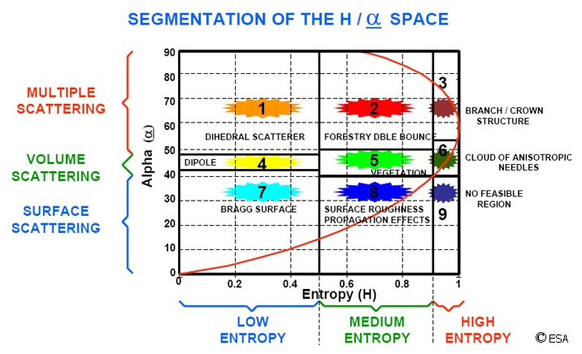

# polsar-ha-classify

Have you ever had PolSAR Pro not classify your H / A decomposition? No? Then this page is not for you.

This Python script / CLI tool implements the H/Alpha classification scheme from *S. Cloude and E. Pottier: "An entropy based classification scheme for land applications of polarimetric SAR".  Geoscience and Remote Sensing, IEEE Transactions on, vol. 35, no. 1, Jan. 1997, pp. 68 - 78.* on an input GDAL-compatible alpha and entropy file where the Alpha (angle) thresholds are dependent on the Entropy (H) bin.

We follow the ESA classification scheme and coloring as below:



##Features
* H-Dependent Thresholds: Implements H-dependent alpha thresholds for more accurate, curved zone boundaries.
* Fully Vectorized: Efficient processing using NumPy, with no slow loops.
* Simple Dependencies: Requires only Python, GDAL, and NumPy.
* Flexible Input: Reads any GDAL-readable format or raw binary files.
* Paletted Output: Creates a single-band, paletted GeoTIFF with an embedded color table for easy visualization in QGIS or other GIS software.

## Requirements
* Python 3.8
* GDAL >= 3.0.0
* NumPy >= 1.20.0

The script was developed and tested with GDAL 3.10.3 and NumPy 2.3.3.

## Usage

Basic Example (GDAL-compatible files):
```bash
python ha9class.py --h_file H.tif --alpha_file alpha.tif --out ha9.tif
```

Raw Binary Example:
```bash
python ha9class.py --h_file H.bin --alpha_file alpha.bin --width 2048 --height 2048 --out ha9.tif
```

Advanced Usage (Custom Thresholds)

The key feature is the ability to customize the H-dependent thresholds. The defaults are set to common "best practice" values.

```bash
python ha9class.py --h_file H.tif --alpha_file alpha.tif \
  --h_thresh 0.5 0.9 \
  --alpha_thresh_low_h 42.5 52.5 \
  --alpha_thresh_med_h 40.0 50.0 \
  --alpha_thresh_high_h 45.0 55.0
```

Full Options:
```text
usage: ha9class.py [-h] --h_file H_FILE --alpha_file ALPHA_FILE [--out OUT]
                   [--width WIDTH] [--height HEIGHT] [--dtype DTYPE]
                   [--byteorder {little,big}] [--h_thresh H_LOW H_HIGH]
                   [--alpha_thresh_low_h A_L1 A_H1]
                   [--alpha_thresh_med_h A_L2 A_H2]
                   [--alpha_thresh_high_h A_L3 A_H3]

H/Alpha 9-Zone Classifier

options:
  -h, --help            show this help message and exit

IO:
  --h_file H_FILE       Input Entropy (H) file (GeoTIFF or raw)
  --alpha_file ALPHA_FILE
                        Input Alpha (alpha) file (GeoTIFF or raw)
  --out OUT             Output paletted GeoTIFF class map

Raw Binary IO:
  --width WIDTH         Required if inputs are raw binary
  --height HEIGHT       Required if inputs are raw binary
  --dtype DTYPE         Raw binary data type (default: float32)
  --byteorder {little,big}

Classification Thresholds:

H/Alpha thresholds. Defaults follow "best practice" H-dependent curves.
Example: ... --h_thresh 0.5 0.9 --alpha_thresh_low_h 42.5 52.5 ...

  --h_thresh H_LOW H_HIGH
                        Entropy thresholds (default: 0.5 0.9)
  --alpha_thresh_low_h A_L1 A_H1
                        Alpha thresholds for Low H bin (default: 42.5 52.5)
  --alpha_thresh_med_h A_L2 A_H2
                        Alpha thresholds for Med H bin (default: 40.0 50.0)
  --alpha_thresh_high_h A_L3 A_H3
                        Alpha thresholds for High H bin (default: 45.0 55.0)
```

## Classification Zones & Colors

This script outputs a paletted GeoTIFF with the following class-to-color mapping. Note that the (H, A) bin-to-class-number mapping is specific to this script.

| Class ID | (H Bin, A Bin)        | Description                     | Color (RGB)           |
|----------|------------------------|---------------------------------|------------------------|
| 0        | N/A                    | nodata / unclassified           | Transparent            |
| 1        | (Low H, High A)        | Dihedral                        | rgb(255,165,0)         |
| 2        | (Med H, High A)        | Forestry / double-bounce        | rgb(204,0,0)           |
| 3        | (High H, High A)       | Branch / crown structure        | rgb(128,0,64)         |
| 4        | (Low H, Med A)         | Dipole                          | rgb(255,204,0)         |
| 5        | (Med H, Med A)         | Vegetation                      | rgb(0,255,0)           |
| 6        | (High H, Med A)        | Anisotropic needles             | rgb(0,100,0)           |
| 7        | (Low H, Low A)         | Bragg surface                   | rgb(0,204,204)         |
| 8        | (Med H, Low A)         | Surface roughness               | rgb(0,51,153)          |
| 9        | (High H, Low A)        | No feasible region              | rgb(153,51,153)        |

## License

This project is licensed under the MIT License - see the LICENSE file for details.
